# AWS - How to implement end to end VPC Endpoint service

## VPC Endpoint について

### VPC Endpoint とは

異なる VPC、または異なるリージョンに配置された AWS サービス同士の通信を、インターネットを経由することなく Amazon のネットワーク内で繋ぐサービス。

### VPC Endpoint の機能

Interface Endpoint、Gateway Load Balancer Endpoint と Gateway Endpoint の3つの機能が提供されている。

- Interface Endpoint: VPC内にインターフェイスを設置して、インターネットゲートウェイを介さずに、VPC外(AWS通信網内)のサービスにアクセスするための機能。
- Gateway Load Balancer Endpoint: サブネットの IP アドレス範囲のプライベート IP アドレスを持つ Elastic Network Interface、トラフィックをインターセプトし、Gateway Load Balancer を使用して設定したネットワークまたはセキュリティサービスにルーティングするエントリポイントとして機能。
- Gateway Endpoint: VPCにゲートウェイ（門）を設置することで、インターネットを介さずに、VPC内のサービスとVPC外（AWS通信網内）のサービスの通信を実現する機能。(AmazonS3 または DynamoDB のいずれかに向かう)

### 各種 VPC Endpoint の使用料金

- [時間単位の使用料金とデータ処理料金が課金するサービス](https://aws.amazon.com/privatelink/pricing/)
  - Interface Endpoint
  - Gateway Load Balancer Endpoint
- 料金なし
  - Gateway Endpoint

### VPC Endpoint を利用するメリット

1. 実質的なインターネットとの出入口を封鎖して、セキュアな経路が実現できる。IGW(Internet Gateway)、NATGW が不要になる。
2. 費用対効果。時間課金は無料か1/6に削減できる。上記、「各種 VPC Endpoint の使用料金」を確認してもらえればわかると思われている。東京リージョンで1時間あたり Interface Endpoint の使用料金は、＄0.014 になっており、それに対して、NATゲートウェイの場合、＄0.62 である(同じ東京リージョンで1時間に処理データ1GBあたり)。

### VPC Endpoint 利用シーン

ユーザーは多くのVPCを管理している場合、プライベートサブネットにあるリソースからAWSのリソースにインターネットを経由せず、セキュアにアクセスする。また、大量に S3 や DynamoDB と通信が発生する場合、VPC Endpoint を使ったら、費用対効果が高くなる。

## 実践デモ - VPC Endpoint で 2つの VPC 間にエンドツーエンドの接続を設定する

Required Time: 1h30m

### Architecture

こちらの構築図で VPC Endpoint の実践デモを作成してみよう。
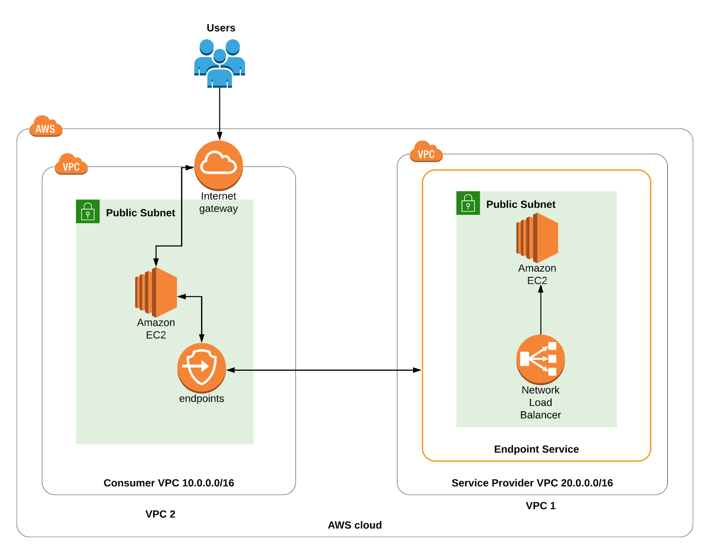

### Step 1. Create a service provider VPC

- Name tag: Service_Network
- IPv4 CIDR: 20.0.0.0/16


### Step 2. Create and attach an IGW

#### 1. Create Service IGW

- Name tag: Service_IGW


#### 2. Attach Service IGW

- Available VPCs: Service_Network


### Step 3. Create a Public subnet

- VPC ID: (プールダウンから選択) Service_Network
- Subnet name: Service_Public_subnet
- Availability Zone:  us-east-1a
- IPv4 CIDR block: 20.0.1.0/24


### Step 4. Create a Public Route Table and associate it with the subnet

#### 1. Create Service Public Route Table

- Name tag: Service_PublicRT


#### 2. Associate Route Table with Service Public subnet

- VPC: (一覧から選択) Service_Network

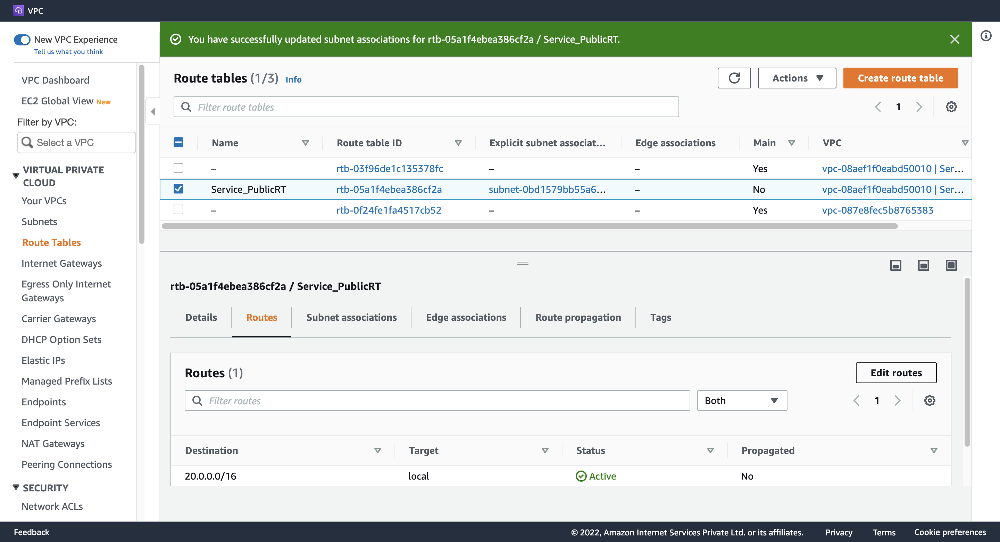

### Step 5. Add the public Route in the Route table

- Destination: 0.0.0.0/0
- Target: (一覧から選択) Internet Gateway

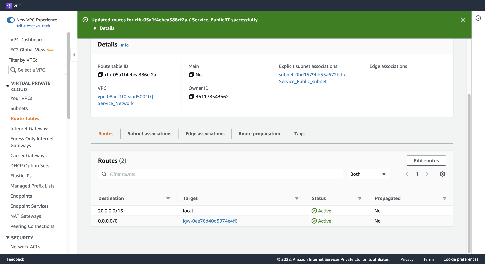

### Step 6. Create an EC2 Instance

#### 1. Configure Instance Detail(Subnet)

- Network: Service_Network
- Subnet: Service_Public_subnet
- Auto-assign Public IP: Enable

#### 2. Configure Advanced Details

- User data:

  ```sh
  #!/bin/bash
  sudo su
  
  yum update -y
  
  yum install httpd -y
  
  systemctl start httpd
  
  systemctl enable httpd
  
  echo "<html><h1> Welcome to Hangyuzs Server 1 </h1><html>" >> /var/www/html/index.html
  
  systemctl restart http
  ```

#### 3. Configure Security Group

- Create security group
- Security group name: Webserver_sg
- Description: Security group for Webserver
- Add Inbound security groups rules
  - rule 1
    - Type: ssh
    - Source type: Anywhere
  - rule 2
    - Type: HTTP
    - Source type: Anywhere
  - rule 3
    - Type: HTTPS
    - Source type: Anywhere


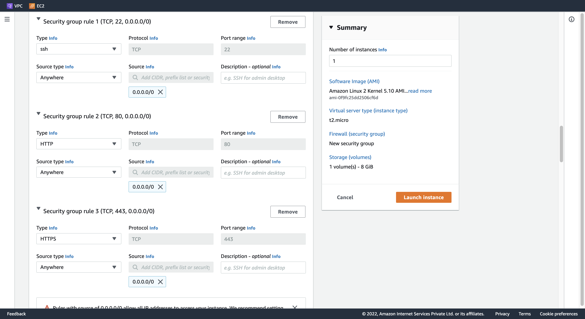

#### 4. Launch instance


### Step 7. Create a Network LoadBalancer

#### 1. Configure LoadBalancer

- Load balancer name: MyNetwork-LB
- Schema: Internet-facing
- Ip address type: IPv4
- VPC: Service_Network
- Mappings: us-east-1a
- Subnet: Service_Public_subnet
- Listeners and routing:
  - Protocol: TCP
  - Port: 80
  - Default action: 下記 [2. Create target group](#2-create-target-group) を参照。


#### 2. Create target group

- Basic Configuration: Instances
- Target group name: MyNetwork-TG
- Protocl: TCP
- Port: 80
- VPC: Service_Network
- Interval: 10 seconds

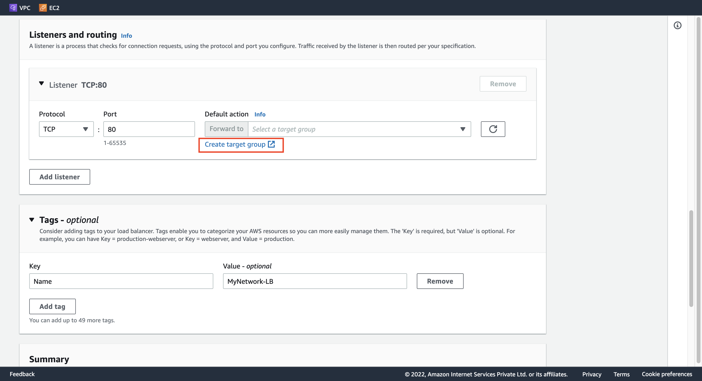


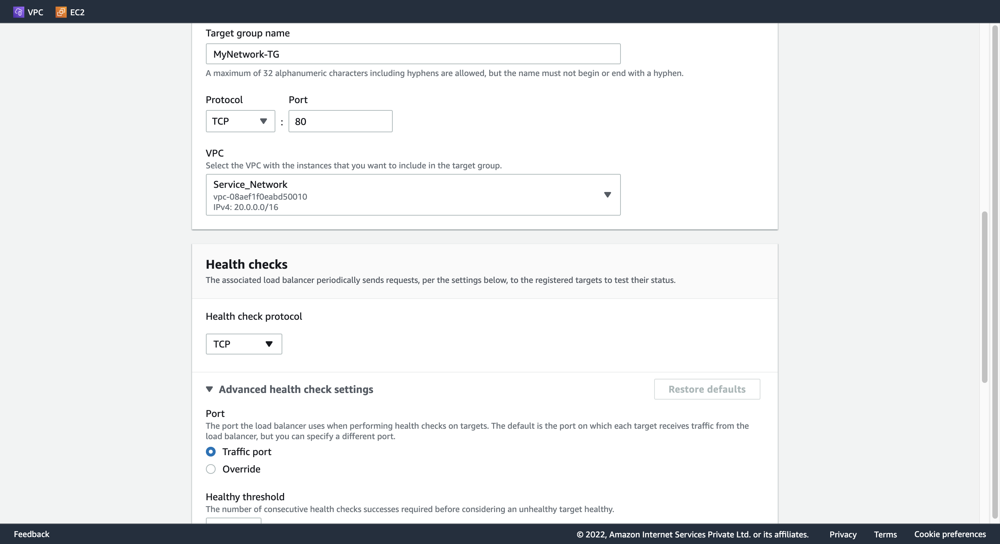


#### 3. Register targets

- Webserver1 を選択し、「Include as pending below」をクリックして、「Create target group」を押す。

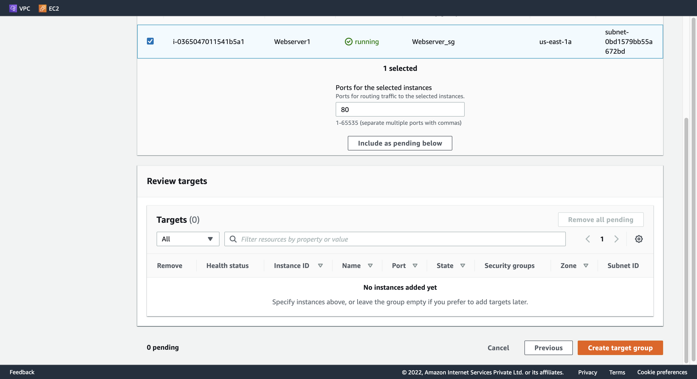


#### 4. DNS name

- **重要:** Target group に遷移して、Targets タブのほう、Health Status が healthy になるのを待つ。

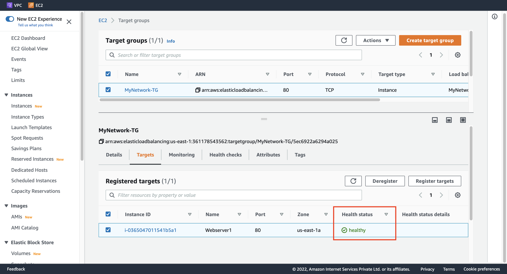

- DNS name に記載してある A Record をコピーして、ブラウザ上で確認する。下記のように表示される。

```
 Welcome to Hangyuzs Server 1 
```


### Step 8. Create an Endpoint service

- Load balancer name: MyNetwork-LB のチェックを入れる。
- Additional settings: 「Acceptance required」 のチェックを入れる。


- Service name をメモする。


### Step 9. Create a customer VPC

- Name tag: Customer_Network
- IPv4 CIDR: 10.0.0.0/16

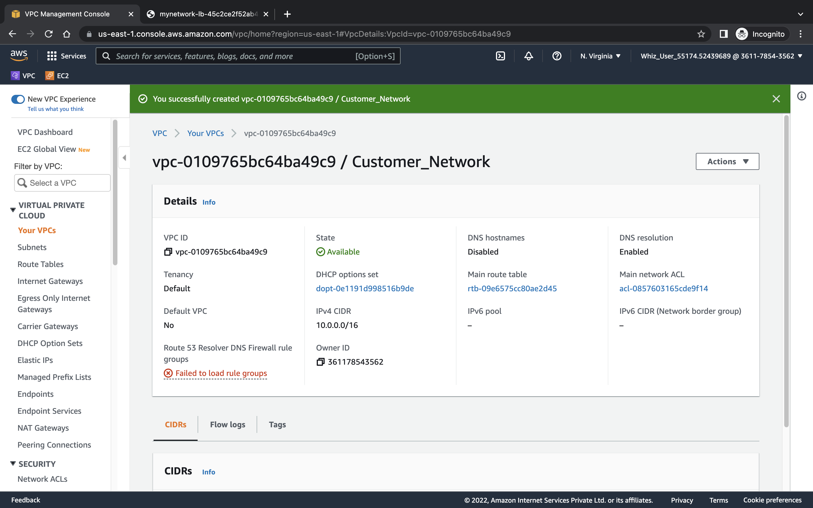

### Step 10. Create and attach an Internet Gateway

#### 1. Create Customer IGW

- Name tag: Customer_IGW


#### 2. Attach Customer IGW

- Available VPCs: Customer_Network


### Step 11. Create a Public subnet

- VPC ID: (プールダウンから選択) Customer_Network
- Subnet name: Customer_Public_subnet
- Availability Zone:  us-east-1a
- IPv4 CIDR block: 10.0.1.0/24

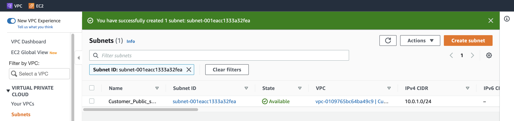

### Step 12. Create a Public Route Table and associate it with the subnet

#### 1. Create Customer Public Route Table

- Name tag: Customer_PublicRT

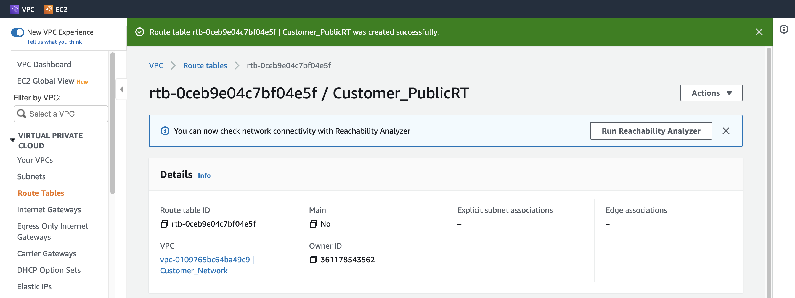

#### 2. Associate Route Table with Customer Public subnet

- VPC: (一覧から選択) Customer_Network


### Step 13. Add the public Route in the Route table

- Destination: 0.0.0.0/0
- Target: (一覧から選択) Internet Gateway

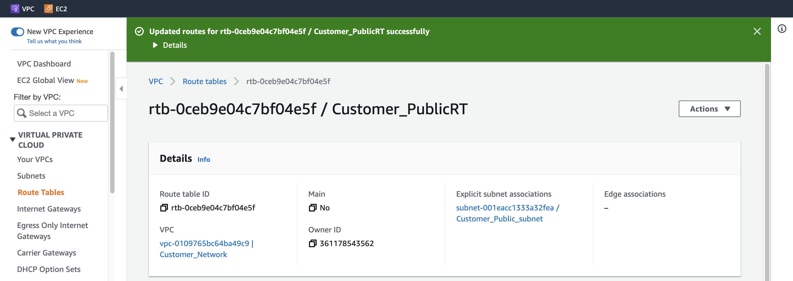

### Step 14. Create an EC2 Instance

#### 1. Configure Instance Detail(Customer)

- Network: Customer_Network
- Subnet: Customer_Public_subnet
- Auto-assign Public IP: Enable

#### 2. Configure Security Group

- Create security group
- Security group name: Customer_EC2_SG
- Description: Security group for Customer EC2
- Add Inbound security groups rules
  - rule 1
    - Type: ssh
    - Source type: Anywhere
  - rule 2
    - Type: HTTP
    - Source type: Anywhere

#### 3. Launch instance

- Customer EC2 の IPv4 アドレスをメモする。


### Step 15. Create a VPC Endpoint

#### 1. Configure Endpoint

- Security category: Other endpoint services
- Service settings:
  - [Step 8](#step-8-create-an-endpoint-service) でメモした Service name をこちらにペストする。
  - Verify service する。
- VPC: (プールダウンから選択) Customer_Network
- Security groups: (一覧から選択) Customer_EC2_SG


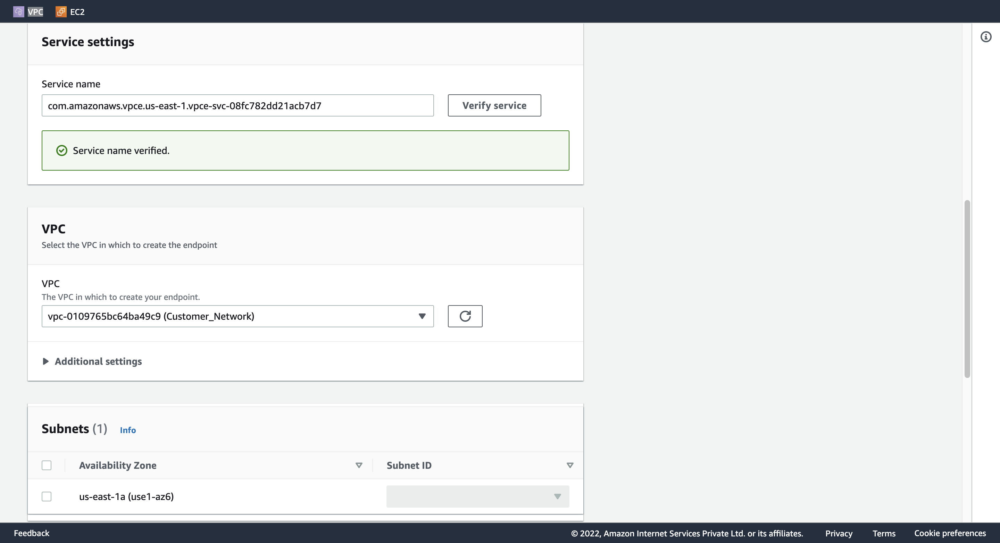


- Endpoint のステータスを確認する。


#### 2. Accept endpoint connection request

- Endpoint Connections を設定して、Endpoint のステータスが Available になるまで待つ。

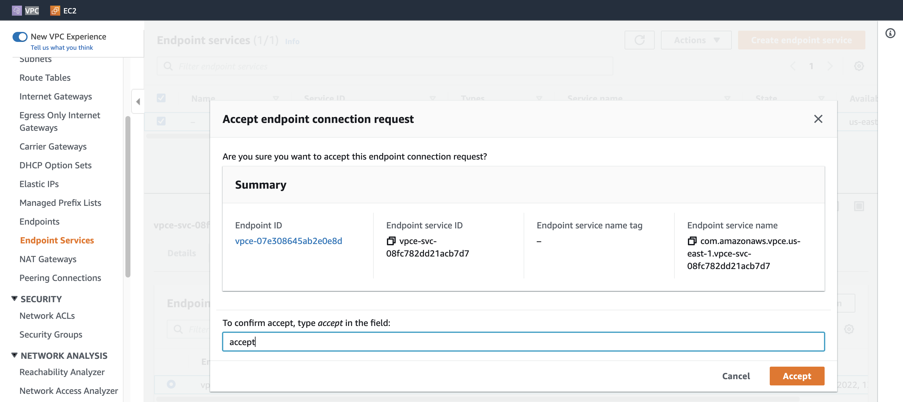

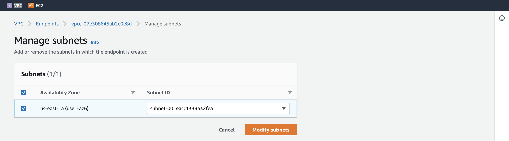

- Endpoint のIPv4 アドレスをメモする。


### Step 16. Test the connectivity

- SSH で Customer EC2 にアクセスして、curl で接続状況を確認する。

```sh
ssh -i {keypair}.pem ec2-user@{Cusotmer_EC2_IPv4_Address}
curl {Endpoint_IPv4_Address}
```

- 下記の内容が返される。

```
<html><h1> Welcome to Hangyuzs Server 1 </h1></html>
```

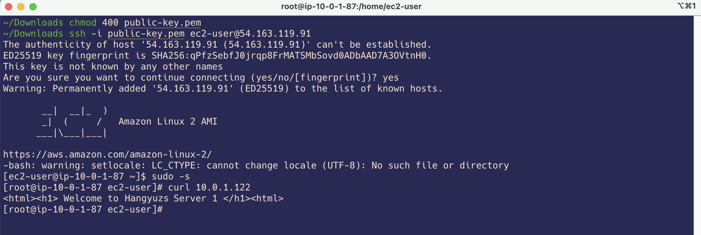

### Step 17. Delete AWS Resources

- リソースを削除する必要がある場合、下記の順番で行えればきれいに削除できる。
  - EC2 Instance (2つ)
  - VPC Endpoint
  - Endpoint Service
  - NLB
  - Target Groups


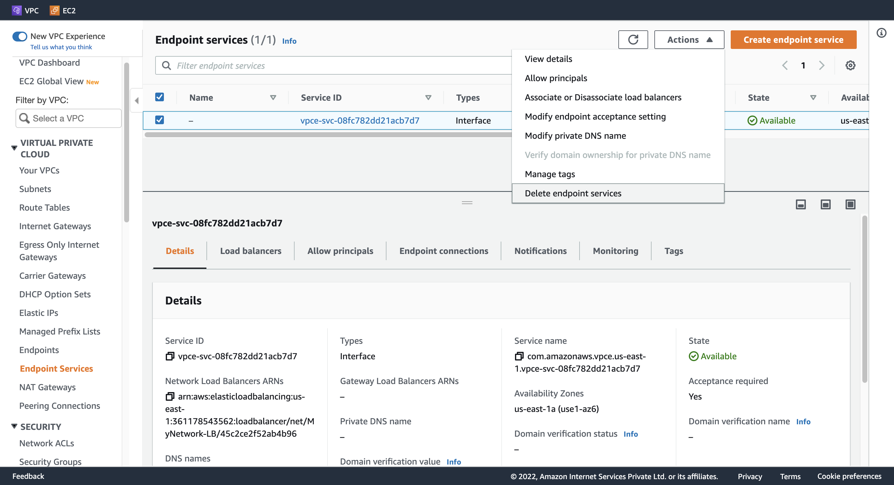


