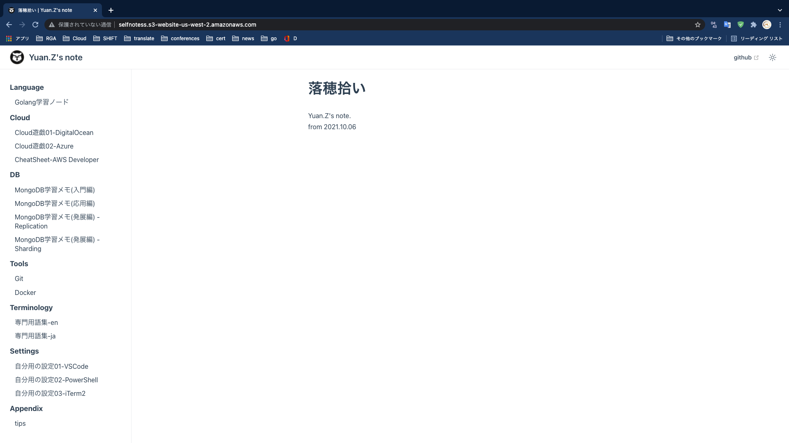

# AWS

## 1. AWS S3 だけで静的コンテンツを配信する

### a. S3 バケットを作成する

selfnotessというバケットを作成した。  
..省略..

### b. self-notes の dist の内容を S3 バケットに配置する(public 状態に変更)


### c. アクセスする



### d. おまけ: CloudFront + Route53 + S3で独自ドメインを追加して配信する方法も試した

[AWS Certificate Manager](https://us-west-2.console.aws.amazon.com/acm/home?region=us-west-2#/firstrun/)

## 2. AWS CLI

### * retrieve solution stack names from ListAvailableSolutionStacks API

```
aws elasticbeanstalk list-available-solution-stacks
```

::: {tip} Output - Example

```
{
    "SolutionStacks": [
        "64bit Amazon Linux 2018.03 v4.17.10 running Node.js",
        "64bit Amazon Linux 2018.03 v2.9.22 running PHP 7.2",
        "64bit Amazon Linux 2018.03 v2.9.22 running PHP 7.3",
        "64bit Amazon Linux 2018.03 v2.9.11 running PHP 5.4",
        "64bit Amazon Linux 2018.03 v2.9.11 running PHP 5.5",
        "64bit Amazon Linux 2018.03 v2.9.11 running PHP 5.6",
        "64bit Amazon Linux 2018.03 v2.9.11 running PHP 7.0",
        "64bit Amazon Linux 2018.03 v2.9.11 running PHP 7.1",
        "64bit Amazon Linux 2018.03 v2.10.5 running Python 3.6",
        "64bit Amazon Linux 2018.03 v2.9.15 running Python 3.4",
        "64bit Amazon Linux 2018.03 v2.9.15 running Python",
        "64bit Amazon Linux 2018.03 v2.9.15 running Python 2.7",
        "64bit Amazon Linux 2018.03 v2.12.11 running Ruby 2.6 (Puma)",
        "64bit Amazon Linux 2018.03 v2.12.11 running Ruby 2.5 (Puma)",
        "64bit Amazon Linux 2018.03 v2.12.11 running Ruby 2.4 (Puma)",
        "64bit Amazon Linux 2018.03 v2.12.11 running Ruby 2.6 (Passenger Standalone)",
        "64bit Amazon Linux 2018.03 v2.12.11 running Ruby 2.5 (Passenger Standalone)",
        "64bit Amazon Linux 2018.03 v2.12.11 running Ruby 2.4 (Passenger Standalone)",
        "64bit Amazon Linux 2018.03 v2.12.0 running Ruby 2.3 (Passenger Standalone)",
        "64bit Amazon Linux 2018.03 v2.12.0 running Ruby 2.2 (Passenger Standalone)",
        "64bit Amazon Linux 2018.03 v2.12.0 running Ruby 2.1 (Passenger Standalone)",
        "64bit Amazon Linux 2018.03 v2.12.0 running Ruby 2.0 (Passenger Standalone)",
        "64bit Amazon Linux 2018.03 v2.12.0 running Ruby 1.9.3",
        "64bit Amazon Linux 2018.03 v2.12.0 running Ruby 2.3 (Puma)",
        "64bit Amazon Linux 2018.03 v2.12.0 running Ruby 2.2 (Puma)",
        "64bit Amazon Linux 2018.03 v2.12.0 running Ruby 2.1 (Puma)",
        "64bit Amazon Linux 2018.03 v2.12.0 running Ruby 2.0 (Puma)",
        "64bit Amazon Linux 2018.03 v3.4.11 running Tomcat 8.5 Java 8",
        "64bit Amazon Linux 2018.03 v3.4.11 running Tomcat 7 Java 7",
        "64bit Amazon Linux 2018.03 v3.4.0 running Tomcat 8 Java 8",
        "64bit Amazon Linux 2018.03 v3.4.0 running Tomcat 7 Java 6",
        "64bit Windows Server Core 2019 v2.7.1 running IIS 10.0",
        "64bit Windows Server 2019 v2.7.1 running IIS 10.0",
        "64bit Windows Server Core 2016 v2.7.1 running IIS 10.0",
        "64bit Windows Server 2016 v2.7.1 running IIS 10.0",
        "64bit Windows Server Core 2012 R2 v2.7.1 running IIS 8.5",
        "64bit Windows Server 2012 R2 v2.7.1 running IIS 8.5",
        "64bit Windows Server Core 2016 v1.2.0 running IIS 10.0",
        "64bit Windows Server 2016 v1.2.0 running IIS 10.0",
        "64bit Windows Server Core 2012 R2 v1.2.0 running IIS 8.5",
        "64bit Windows Server 2012 R2 v1.2.0 running IIS 8.5",
        "64bit Windows Server 2012 v1.2.0 running IIS 8",
        "64bit Windows Server Core 2012 R2 running IIS 8.5",
        "64bit Windows Server 2012 R2 running IIS 8.5",
        "64bit Windows Server 2012 running IIS 8",
        "64bit Amazon Linux 2018.03 v2.17.0 running Docker 20.10.7-ce",
        "64bit Amazon Linux 2018.03 v2.27.0 running Multi-container Docker 20.10.7-ce (Generic)",
        "64bit Debian jessie v2.16.0 running Go 1.4 (Preconfigured - Docker)",
        "64bit Debian jessie v2.16.0 running Go 1.3 (Preconfigured - Docker)",
        "64bit Debian jessie v2.16.0 running Python 3.4 (Preconfigured - Docker)",
        "64bit Amazon Linux 2 v3.4.7 running Docker",
        "64bit Amazon Linux 2 v4.2.6 running Tomcat 8.5 Corretto 11",
        "64bit Amazon Linux 2 v4.2.6 running Tomcat 8.5 Corretto 8",
        "64bit Amazon Linux 2 v4.2.6 running Tomcat 7 Corretto 11",
        "64bit Amazon Linux 2 v4.2.6 running Tomcat 7 Corretto 8",
        "64bit Amazon Linux 2 v3.3.6 running PHP 8.0",
        "64bit Amazon Linux 2 v3.3.6 running PHP 7.4",
        "64bit Amazon Linux 2 v3.3.6 running PHP 7.3",
        "64bit Amazon Linux 2 v3.3.6 running PHP 7.2",
        "64bit Amazon Linux 2 v5.4.6 running Node.js 14",
        "64bit Amazon Linux 2 v5.4.6 running Node.js 12",
        "64bit Amazon Linux 2 v5.4.6 running Node.js 10",
        "64bit Amazon Linux 2 v3.2.6 running Corretto 11",
        "64bit Amazon Linux 2 v3.3.6 running Python 3.8",
        "64bit Amazon Linux 2 v3.4.1 running Go 1",
        "64bit Amazon Linux 2 v3.3.6 running Python 3.7",
        "64bit Amazon Linux 2 v3.2.6 running Corretto 8",
        "64bit Amazon Linux 2 v3.3.6 running Ruby 2.7",
        "64bit Amazon Linux 2 v3.3.6 running Ruby 2.6",
        "64bit Amazon Linux 2 v3.3.6 running Ruby 2.5",
        "64bit Amazon Linux 2 v2.2.6 running .NET Core",
        "64bit Amazon Linux 2018.03 v2.11.12 running Java 8",
        "64bit Amazon Linux 2018.03 v2.11.12 running Java 7",
        "64bit Amazon Linux 2018.03 v2.18.7 running Go 1.16",
        "64bit Amazon Linux 2018.03 v2.6.33 running Packer 1.0.3",
        "64bit Amazon Linux 2018.03 v2.17.0 running GlassFish 5.0 Java 8 (Preconfigured - Docker)"
    ],
    "SolutionStackDetails": [
      {
        ...
      },
      ...
    ]
}
```

:::

[Ref: Elastic Beanstalk supported platforms](https://docs.aws.amazon.com/elasticbeanstalk/latest/dg/concepts.platforms.html)

### 2-2 Update access key

#### create a new access key

```
aws iam create-access-key
```

#### configure new access key

```
aws configure
aws iam update-access-key --access-key-id {OLD_ACCESS_KEY} --status Inactive --user-name {user_name}
aws iam update-access-key --access-key-id {NEW_ACCESS_KEY} --status Active --user-name {user_name}
cat .aws/config
cat .aws/credentials
aws configure list
```

#### try to access s3 with new configuration

```
aws s3 ls
```

#### delete old access key

```
aws iam delete-access-key --access-key-id {OLD_ACCESS_KEY} --user-name zhang.yuan
```

*Ref:[Rotating access keys (AWS CLI)](https://docs.aws.amazon.com/ja_jp/IAM/latest/UserGuide/id_credentials_access-keys.html#rotating_access_keys_cli)*
