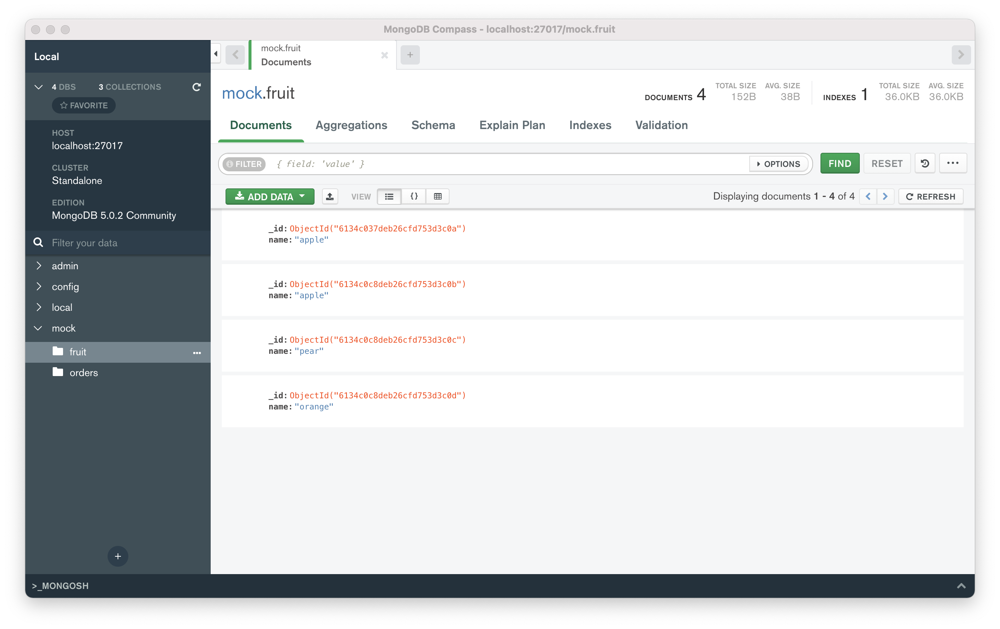

# MongoDB - Getting Started

MacOS環境で、MongoDBの導入から基本操作(CRUD)までをまとめるメモ。

## MongoDB 導入(概要)

### 1. brewでインストール

```sh
brew install mongodb-community
```

### 2. バージョン確認

```sh
mongo --version
```

### 3. ローカルからの起動について(mongosh)

### brewでサービスを起動

```sh
brew services start mongodb-community
```

### MongoDBホームページの方法でDBにアクセス

#### ログイン情報

```text
username: tstdemo
password: *****
```

#### ログインコマンド

```sh
mongosh "mongodb+srv://{tstyuan}.qtihi.mongodb.net/{DB名}" --username {tstdemo}
```

#### サービスを停止する

```sh
brew services stop mongodb-community
```

### ローカル環境で操作開始

```sh
mongo
```

### Compass(MongoDB用GUI)について

アクセスしたイメージは下図のように見える


デフォルトのDBは３つある。

1. admin
2. config
3. local

※ 上図にあるmock DBは自分がdumpしたもの。

## MongoDB 構造

```text
- DB
 - Collection
  - Document_1
  - Document_2
  - ...
  - Document_n
```

## 1. DB について

### db 一覧

```sh
show dbs
```

### db 削除

```sh
db.dropDatabase();
```

## 2. Collection について

### collection 一覧

```sh
show collections
```

### collection 作成

```sh
db.createCollection('コレクション名');
```

### collection 削除(回復できない！！)

```sh
db.fruit.drop();
```

## 3. Document について

### insert フォーマット

```sh
db.{collection}.insertOne({JSON対象})
db.{collection}.insertMany([{JSON 1}, {JSON 2}, ...{JSON n}])
```

例  

```sh
db.fruit.insertOne({name: "apple"})
db.fruit.insertMany([
  {name: "apple"},
  {name: "pear"},
  {name: "orange"}
])
```

### find 検索

```sh
db.{collection_name}.find({検索条件})
```

例

```sh
db.{collection_name}.find({"year":2021})
db.{collection_name}.find({$and/or: [{"year":2021}, {"name":namae}]})　複数条件 and または or
db.{collection_name}.find({"title": /^B/} )    ※正規表現も検索できる
```

### MQLとSQLにおける条件指定の表現対照

|      SQL       |                   MQL                    |
| :------------: | :--------------------------------------: |
|     a = 1      |                  {a: 1}                  |
|     a <> 1     |              {a: {$ne: 1}}               |
|     a > 1      |              {a: {$gt: 1}}               |
|     a >= 1     |              {a: {$gte: 1}}              |
|     a < 1      |              {a: {$lt: 1}}               |
|     a <= 1     |              {a: {$lte: 1}}              |
| a = 1 AND b =1 | {a: 1, b: 1} or {$and: [{a: 1}, {b: 1}]} |
| a = 1 OR b = 1 |         {$or: [{a: 1}, {b: 1}]}          |
|   a IS NULL    |          {a: {$exists: false}}           |
| a IN (1, 2, 3) |          {a: {$in: [1, 2, 3]}}           |

### find()で"feild.sub_field"を検索するとき、必ず、sub_fieldまで書くこと。feildのみでの検索は何も返されない

```sh
db.fruit.insertOne(
  name: "apple",
  from: {
      country: "Japan",
      province: "Tokyo"
  }
)
```

上記のデータを作成し、下の例で検索してみればわかる。  

```sh
db.fruit.find({"from.country": "Japan"})
db.fruit.find({"from": {country: "Japan"}}) ← 何も返されない。
```

### find()で配列も検索できる

```sh
db.fruit.insert([
  {"name": "Apple", color: ["red", "green"]},
  {"name": "Mango, color:["yellow", "green"]}
])
```

  上記のデータを作成し、下の例で検索してみる。  

```sh
db.fruit.find({color: "red"})` 1つの結果が返される  
db.fruit.find({$or: [{color: "red"}, {color: "yellow"}]}) 2つの結果が返される  
```

### 複数の条件で検索するとき、$elemMatchでの例

```sh
db.getCollection('movies').find({
  "filming_locations": {
      $elemMatch: {"city": "Rome", "country": "USA"}
  }
})
```

※下記のように検索してみて上記との結果について考えてみる。

```sh
db.getCollection('movies').find({
  "filming_location.city": "Rome",
  "filming_location.country": "USA"
})
```

### 検索結果をフォーマットして検索する方法

```sh
db.movies.find({"category": "action"}, {"_id":0, title:1}) ←idを返さず、タイトルのみ返す指定
```

### remove 削除

```sh
db.fruit.remove({<条件を指定する>})
db.fruit.remove({}) fruitコレクションの全てを削除する。
db.fruit.remove() ※削除できない！！エラーが返される。
```

### update 更新

```sh
db.fruit.update({検索条件}, {$set: 更新内容})  
```

  例  
  このデータを挿入する。

```sh
db.fruit.insertMany([
  {name: "apple"},
  {name: "pear"},
  {name: "orange"}
])
```

この文で更新してみる。

```sh
db.fruit.updateOne({"name": "apple"}, {$set: {from: "Japan"}})
```

注意事項：

- `updateOne`複数文での更新はすべてはできない、一行目の文での更新しかできない。
- `updateMany`複数文でも更新できる
- `更新内容`部分の指定は以下に必ず書くこと。
  - ＄set/＄unset
  - ＄push/＄pushAll/ ＄pop
  - ＄pull/ ＄pullAll
  - ＄addToSet

次回のメモは、簡単なサンプル(Python + MongoDB)を作成して、Mongo DBを理解する。
