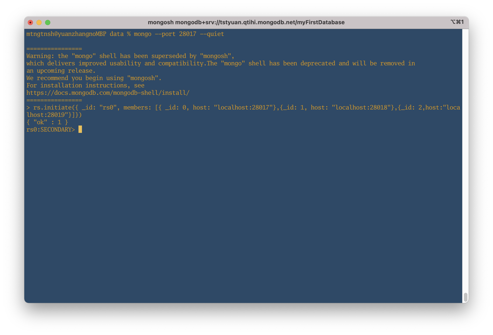
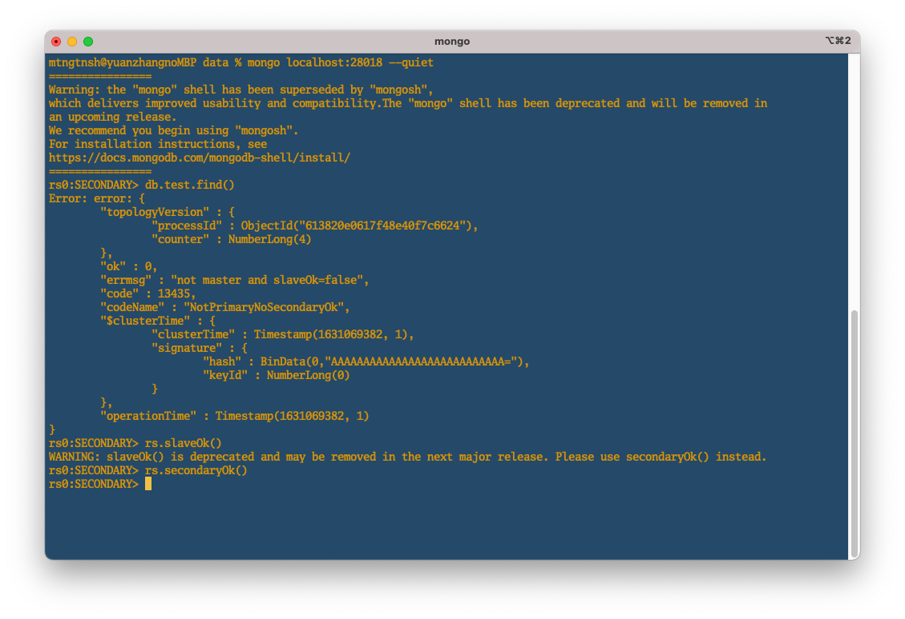
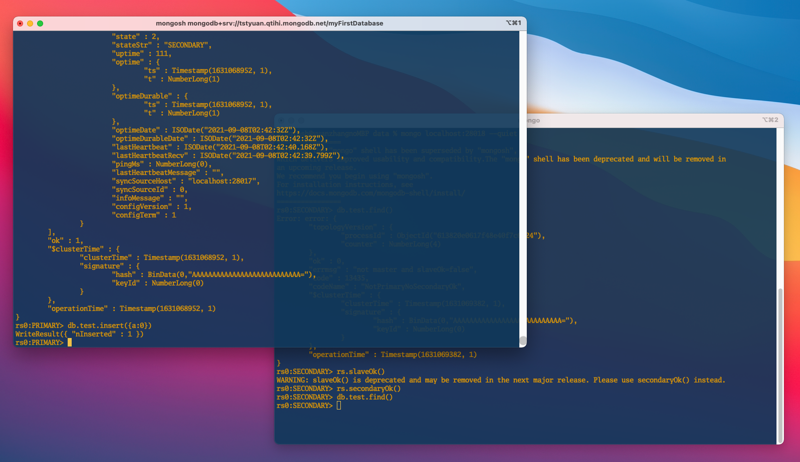

# MongoDB - Replication

なぜレプリケーションをセットするのかを、本メモでは割愛する。
インターネット上、同じようなセットアップに関連する情報は多々存在しているが、実際に手を動かしてみて、少し異なるところがあったので、自分がやりやすい方法をまとめる。

## ローカル環境にMongoDBを3つ起動してレプリケーションをセットアップする

環境:  
MongoDB: 5.0.2  
MacOS: Big Sur 11.5.2

## 1. データファイルを格納するためのフォルダを作成

データファイル格納用フォルダ用に data フォルダーを作成し、さらにその配下に3つインスタンス用のデータファイル格納用フォルダ(db1, db2, db3)を作成する。

```shell
mkdir -p db{1,2,3}
```

## 2. 設定ファイル(mongod.conf)を作成

MongoDBの設定ファイル(mongod.conf)のオプションについては、[MongoDBの公式ドキュメント](https://docs.mongodb.com/manual/reference/configuration-options/)を参照。
db1, db2, db3はそれぞれ作成するのが必要。

### ディレクトリ構成

```tex
|data
|--db1
|  |--mongod.conf
|--db2
|  |--mongod.conf
|--db3
|  |--mongod.conf  
```

### ポート番号

下記で設定する。

- db1: 28017
- db2: 28018
- db3: 28019

### 設定ファイルにの内容

db1用のmongod.confはこの内容で設定している。

```
systemLog:
    destination: file
    path: {usr}/data/db1/mongod.log
    logAppend: true
storage:
    dbPath: {usr}/data/db1
net:
    bindIp: 0.0.0.0
    port: 28017        # ポート番号
replication:
    replSetName: rs0   # レプリカセット名:rs0
processManagement:
    fork: true
```

db2, db3 は上記の設定を各自のフォルダにコピーして、`path`、`dbPath`、`port`をそれぞれ修正する。

## 3. 設定ファイルを適用

下記のコマンドで設定ファイルを適用する。

```sh
mongod -f {DBディレクトリ名}/mongod.conf
```

db1のmongod.confを適用する。

```sh
mongod -f db1/mongod.conf
```

設定ファイルの適用ができた場合、下記のようなメッセージが表示される。

```tex
about to fork child process, waiting until server is ready for connections.
forked process: 87472
child process started successfully, parent exiting
```

db2, db3 も同様に適用する。
適用してから、稼働状況をさらに確認したいなら、`ps`コマンドでも見てみよう。

```sh
ps -ef | grep mongod
```

## 4. インスタンスに接続

設定ファイルが適用できたら、下記のコマンドで db1 にアクセスする。

```sh
mongod --port 28017 --quiet
```

※ `--quiet`は、接続情報を簡潔に表示されるオプション。

### 1) rs.initiate()でレプリカセットのメンバーを追加

参照：[rs.initiate()について](https://docs.mongodb.com/manual/reference/method/rs.initiate/)
rs.initiate()は、新しいレプリカセットの設定時、初期化するメソッド。
rs.add()でも使えるが、便利のため、rs.initiate()でセットするとき、db1, db2, db3のホスト情報を``members`という設定フィルドに追加した。

```sh
rs.initiate({ _id: "rs0", members: [{ _id: 0, host: "localhost:28017"},{_id: 1, host: "localhost:28018"},{_id: 2,host:"localhost:28019"}]})
```

上記のコマンド叩いた結果、

```
{ "ok" : 1 }
```


上図から、

```
rs0:SECONDARY>
```

になっている。
もう一回`Enter`すると、

```
rs0:PRIMARY>
```

に切り替える。
ここまでに進んできて、すでに"rs0"というレプリカセットのメンバー(db1)にアクセスできた。

`PRIMARY`や`SECONDARY`は何ものかは、こちらのページ[「Replica Set Members」](https://docs.mongodb.com/manual/core/replica-set-members/)を参照。

> The replica set can have at most one primary. If the current primary becomes unavailable, an election determines the new primary.  

初期化されてから、デフォルトの設定で `SECONDARY`と認められる。上記の説明から、現在のレプリカセットは、`PRIMARY`(1つ)、`SECONDARY`(2つ)があると明らかにした。

次の動作を検証するため、もう一回`Enter`すると、db1を`PRIMARY`に変更した。
そのため、現時点で、db1が`PRIMARY`として設定していて、まだログインしていないdb2, db3は`SECONDARY`になった。次のステップで、各メンバーの`stateStr`で確認できる。無論、db1 が一時的に死んでしまった場合、db2, db3のどれかが`PRIMARY`に変更される。

### 2) メンバーの追加状況を確認

こちらのコマンド確認する。

```sh
rs.status()
```

上図で、db1 の`stateStr`が”PRIMARY”になっているのがわかった。

## 5. レプリカセットの稼働状況を確認

db1 が "PRIMARY"である限りなり、書き込みと読み込みができるので、db1 にデータを挿入してみて、db2 側から様子を確認する。
本メモは、"Arbiter"というメンバーをスキップしている。
※時間がある時こちらのドキュメントをチェックする→["Arbiter"について](https://docs.mongodb.com/manual/core/replica-set-members/#arbiter)

### メンバー db2 にアクセスする

```sh
mongo localhost:28018 --quiet
```

上記のコマンドでdb2 にアクセスしてから、db1の内容が見れるのかを、下記のコマンドで試す。

```sh
db.test.find()
```

しかし、

```tex
"errmsg" : "not master and slaveOk=false",
```

というエラーメッセージが返された。
そのメッセージは、まだ db1 の slave(奴隷) になってないよ、db1とは知らない人っと理解してもいいから、両方の関係を築き上げよう。
最初は、`rs.slaveOk()`で試していた。次のリリースで削除されるそうなので、推奨の`rs.secondaryOk()`で設定できた。


```sh
db.test.find()
```

で　もう一回確認してみて問題が解決した。

メンバー db1 にデータを追加して、db2 から確認する。
db1にデータをinsertする。

```sh
db.test.insert({a:0})
```



即座に、db2 側で確認する。


db1 で insert した`{a: 0}`が db2 側で見れた！
ローカル環境だから、迅速と感じだが、レプリカセットのメンバーが遠距離であっても、数十ミリ秒程度の遅延しか出ない噂がある。。

### db1 を kill してから db2 が昇格

`ps`で db1 のプロセス番号を確認し、kill しよう。
今回は `aux`を使ってみる。  ※`ef`派と`aux`派がこれからもpeace&loveで暮らしていくように。余談→[あなたはPS -EF派なのか、AUXF派なのかをちょっとだけまとめてみた](https://ten-snapon.com/archives/2646)

```shell
ps aux | grep mongod
kill {process_id}
```

しばらく待ってから、db1 が稼働していないことが確認できる。
db2が`PRIMARY`に昇格されることも確認できる。


### おまけ - db1を再起動したら、どうなるのか?

db1がまた`PRIMARY`に昇格されるか、そのまま`SECONDARY`としているのか？
db2が 死んでいない限り、db1 が `SECONDARY`として生きていくはず。。
以上はレプリケーションをセットアップする方法。

次は、MongoDBのシャーディングを学習する予定なので、ネットから調べてきた1台の物理マシンにポートを分けて数台のサーバを立ち上げるパターンではなく、数台のVM(シャード)を作成してシャーディングしてみたい。
>Sharding is a method for distributing data across  **multiple machines** .

 _出典:[Sharding](https://docs.mongodb.com/manual/sharding/#sharding)_
