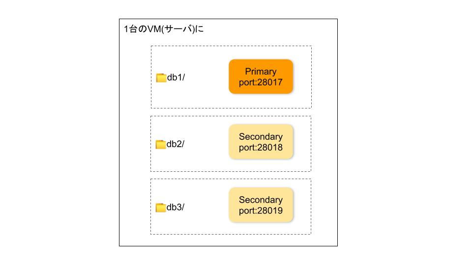
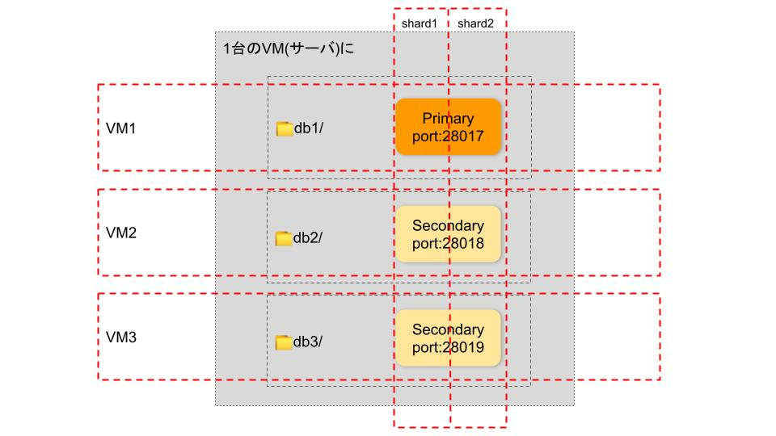
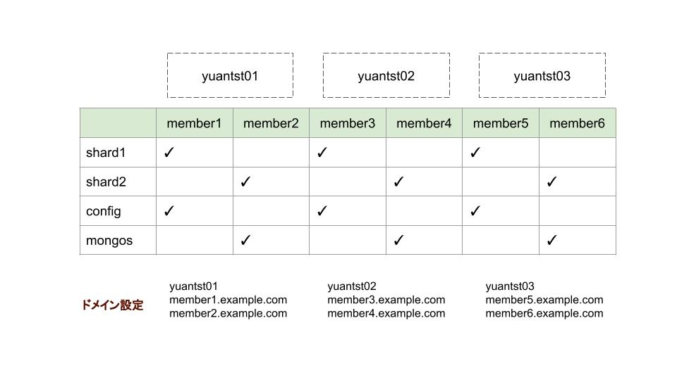
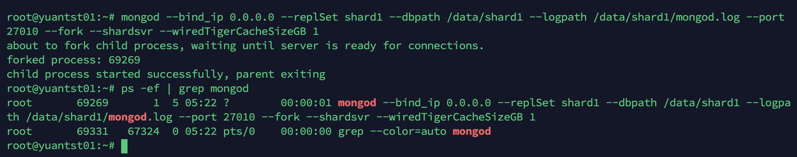
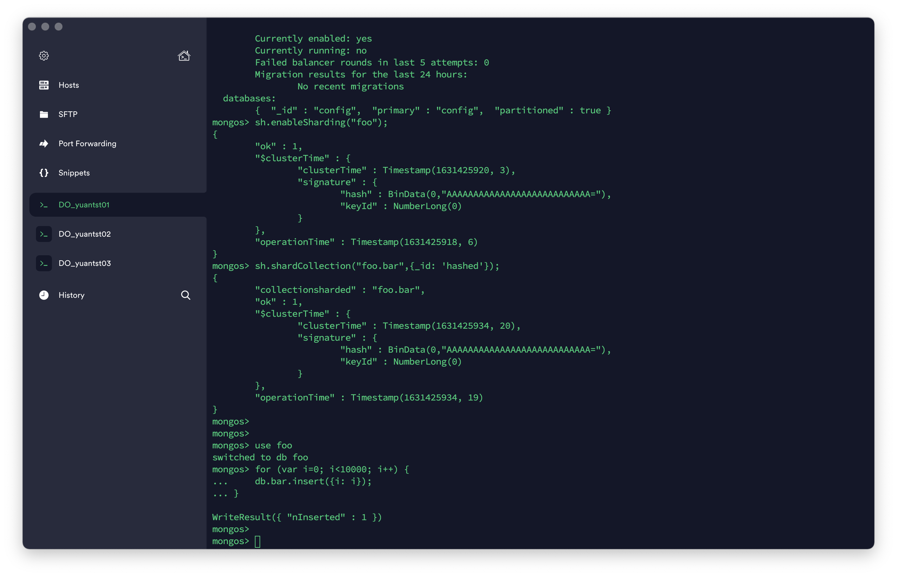
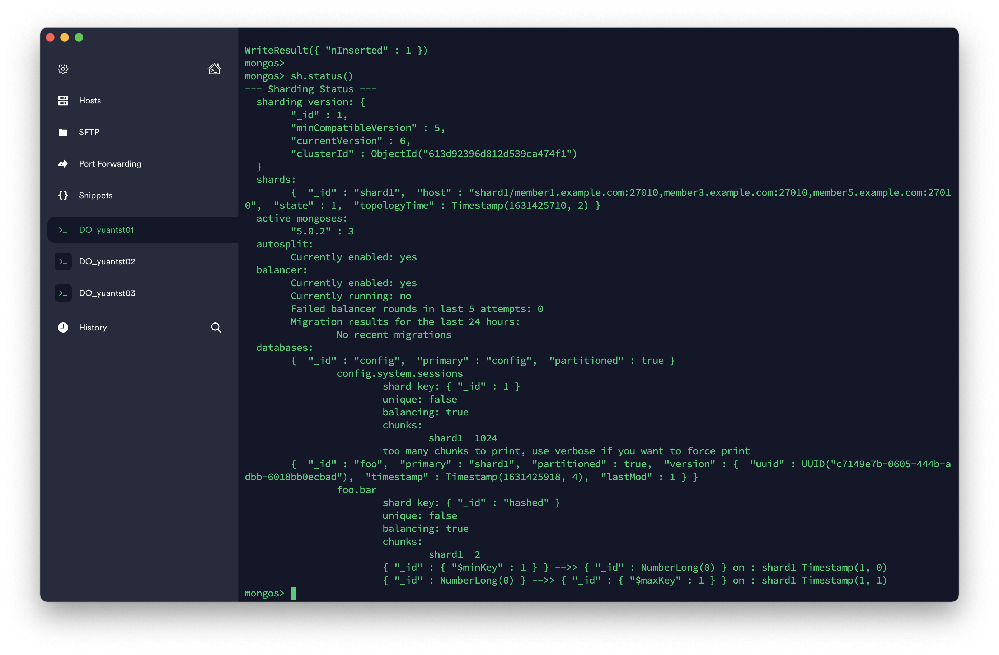
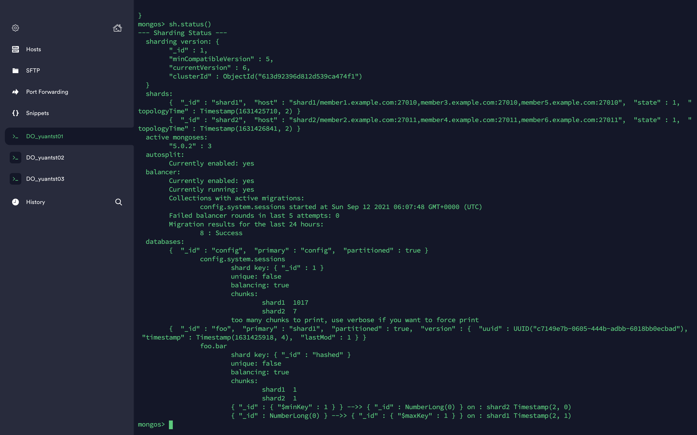
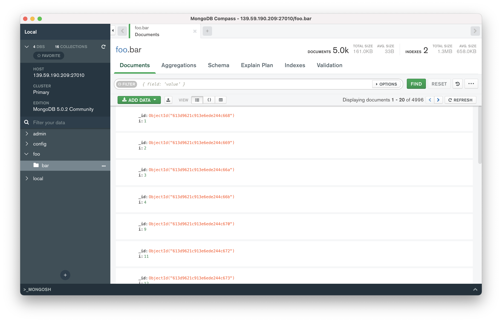

# MongoDB - Sharding

## 背景

​　前編にてレプリケーションについて学習した。それは、3つのフォルダに1つのDBを同様に配置すると理解してもらってもいいと思った。このようなイメージになる。



シャーディングは、レプリカセットをさらにカットしてDBを分割し、別のマシンに配置すると自分が理解しております。


ところで、以下の内容を理解していただいてから、シャーティングをセットアップするのがおすすめです。

- [Sharded Cluster Components(構築要素): Shards, Config Servers, Router(mongos)](https://docs.mongodb.com/manual/core/sharded-cluster-components/#sharded-cluster-components)
- [Shard Keys(インデックス)](https://docs.mongodb.com/manual/core/sharding-shard-key/#shard-keys)
- [Data Partitioning with Chunks(ShardのデータはChunksで分割)](https://docs.mongodb.com/manual/core/sharding-data-partitioning/#data-partitioning-with-chunks)

## はじめに

### ◆目標

​シャード(Shard)が2つあるシャーディングデモを構築する。

### ◆ アーキテクチャ図①

​下記の3つのVM(yuantst01, yuantst02, yuantst03)にShard、Config サーバ、Router(mongos)を配置するイメージは、こちら↓↓↓  
(mongos は yuantst01 のみに配置していると見えるが、yuantst02, yuantst03へのアクセスもできる次の「アーキテクチャ図②」に反映)


### ◆ 環境

- VM: ubuntu 20.04(LTS) 3台、メモリ4GB/ディスク20GB
  - yuantst01 (139.59.190.209)
  - yuantst02 (139.59.182.250)
  - yuantst03 (139.59.178.240)
- MongoDB: 5.0.2 (各VMにインストール)

### ◆ アーキテクチャ図②

​　レプリケーションと異なり、今回は、1つのシャードのポート番号をさらに分割しない。DBを3つのVMに配置することを前提とし、ドメイン指定で、シャードを分割する。アーキテクチャ図①を表で書くと、ドメインは下記のように設定する。
　レプリカセットには、メンバー(1つのPrimary, 2つのSecondary)がある。そのコンセプトを使って、下図のmember1,member3,member5をshard1(レプリカセットのようなもの)の3つメンバーとして作成する、member2,member4,member6をshard2の3つメンバーとして作成するのを理解してもいい。



### ◆ 手順

1. ドメイン設定(hosts追加)
2. Shardingディレクトリを用意
3. 1つ目のShardを作成して初期化
4. Config サーバのレプリカセットを作成して初期化
5. Router(mongos)を設定
6. 大量データを作成(Shardキーを`hashed`で設定)
7. 2つ目のShardを追加
8. Router(mongos)に配置

## セットアップ手順

### 1. 各VMにhosts設定を追加

```sh
echo "139.59.190.209 yuantst01 member1.example.com member2.example.com" >> /etc/hosts
echo "139.59.182.250 yuantst02 member3.example.com member4.example.com" >> /etc/hosts
echo "139.59.178.240 yuantst03 member5.example.com member6.example.com" >> /etc/hosts
```

### 2. ディレクトリを用意

```sh
mkdir -p /data/shard1/
mkdir -p /data/config/
```

```sh
mkdir -p /data/shard2/
mkdir -p /data/mongos/
```

### 3. 1つ目のシャードを設定

```sh
mongod --bind_ip 0.0.0.0 \
  --replSet shard1 \
  --dbpath /data/shard1 \
  --logpath /data/shard1/mongod.log \
  --port 27010 \
  --fork \
  --shardsvr \
  --wiredTigerCacheSizeGB 1
```

`--shardsvr --wiredTigerCacheSizeGB 1`は内部キャッシュの最大値を少なめに(1GB)設定する。
メモリ4GBのVMに対して、デフォルトのキャッシュ値は1.5GBになる。
参考: [*storage.wiredTiger.engineConfig.cacheSizeGB*](https://docs.mongodb.com/manual/reference/configuration-options/#mongodb-setting-storage.wiredTiger.engineConfig.cacheSizeGB)



```sh
mongo member1.example.com:27010 --quiet
```

```sh
rs.initiate({ \
  _id: "shard1", \
  members: [ \
    { _id: 0, host: "member1.example.com:27010"},\
    {_id: 1, host: "member3.example.com:27010"},\
    {_id: 2,host:"member5.example.com:27010"}]})
```


### 4. configサーバを設定

```sh
mongod --bind_ip 0.0.0.0 --replSet config --dbpath /data/config --logpath /data/config/mongod.log --port 27019 --fork --configsvr --wiredTigerCacheSizeGB 1
```

```sh
mongo member1.example.com:27019 --quiet
```

```sh
rs.initiate({ \
  _id: "config", \
  members: [ \
    { _id: 0, host: "member1.example.com:27019"},\
    {_id: 1, host: "member3.example.com:27019"},\
    {_id: 2,host:"member5.example.com:27019"}]})
```

### 5. mongosを設定

```sh
mongos --bind_ip 0.0.0.0 --logpath /data/mongos/mongos.log --port 27017 --fork --configdb config/member1.example.com:27019,member3.example.com:27019,member5.example.com:27019
```

```sh
mongo member1.example.com:27017 --quiet
```

```sh
sh.addShard("shard1/member1.example.com:27010,member3.example.com:27010,member5.example.com:27010");
```

追加してから、詳細を確認する。

```sh
sh.status()
```

### 6. 大量なデータを作成

シャード(foo)用のCollection(bar)をデフォルトフィールドの`_id`をhashedというShard Keysとして作成する。

```sh
sh.enableSharding("foo");
sh.shardCollection("foo.bar",{_id: 'hashed'});
```


10000件のデータを作成する。

```sh
use foo
for (var i=0; i<10000; i++) {
    db.bar.insert({i: i});
}
```



作成したCollectionの状況を確認する。

上図から、`chunks: shard1 2...`と返されている。それは、barというコレクションは、2つのChunkで分割されていることを示している。
どのように分割されているのかは、`{"_id" : {"$minKey" : 1 }} -->> {"_id" : NumberLong(0) } on : shard1 Timestamp(1, 0)...`と2つの形だと分かれている。

データの範囲を使ってShard キー指定する方法もあるが、`hashed` という形で試したかったから、デフォルトの`_id`フィールドで指定していた。目でデータを確認するとき、分かりづらいと思われがちだが、推奨されている方法である。

> The field you choose as your hashed shard key should have a good cardinality, or large number of different values. Hashed keys are ideal for shard keys with fields that change monotonically like ObjectId values or timestamps. A good example of this is the default `_id` field, assuming it only contains ObjectId values.

*出典: [Hashed Sharding Shard Key](https://docs.mongodb.com/manual/core/hashed-sharding/#hashed-sharding-shard-key)*
直訳すると、
*"ハッシュされたシャードキーとして選択するフィールドは、適切なcardinality、または多数の異なる値を持っている必要がある。ハッシュキーは、ObjectIdやタイムスタンプのように単調に変化するフィールドを持つシャードキーに最適。良い例は、ObjectIdのみが含まれていると仮定した場合のデフォルト`_id`フィールドです。"*

### 7. 2つ目のシャードを設定

1つ目のシャードを作成する方法と同様に、2つ目のシャードを設定する。

```sh
mongod --bind_ip 0.0.0.0 --replSet shard2 --dbpath /data/shard2 --logpath /data/shard2/mongod.log --port 27011 --fork --shardsvr --wiredTigerCacheSizeGB 1
```

```sh
mongo member2.example.com:27011 --quiet
```

```sh
rs.initiate({ \
  _id: "shard2", \
  members: [ \
    { _id: 0, host: "member2.example.com:27011"},\
    {_id: 1, host: "member4.example.com:27011"},\
    {_id: 2,host:"member6.example.com:27011"}]})
```

### 8. 2つ目のシャードをmongosに追加

```sh
mongo member1.example.com:27017 --quiet
```

```sh
sh.addShard("shard2/member2.example.com:27011,member4.example.com:27011,member6.example.com:27011");
sh.status()
```

シャードfooのCollection(bar)を確認する。


```sh
sh.status()
```

別のVMでもシャーディングの状況も確認できる。yuantst02では、


実際、Collection(bar)のデータはどのように分割されているのかをGUI(Compass)で確認してみよう。
Shard1は、10000件データのうち、4996件がこちらに格納されている。



Shard2は、10000件データのうち、5004件がこちらに格納されている。


無事にシャーディングで分割しました。
以上。
